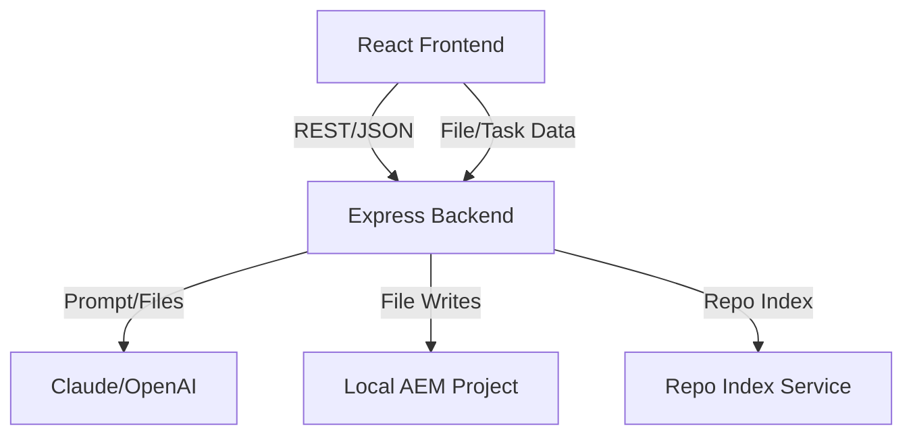

# Deloitte AEM Labs — Project Architecture

## Overview
This project is a full-stack AI-powered AEM training platform. It enables users to:
- Scaffold AEM features (components, models, dialogs, etc.) using natural language
- Learn AEM concepts interactively
- Review and explain code with AI
- Run and manage AEM project tasks from a modern web UI

---

## High-Level Architecture

```
+-------------------+         +-------------------+         +-------------------+
|    Frontend (UI)  | <-----> |     Backend API   | <-----> |   AI/LLM Service  |
+-------------------+         +-------------------+         +-------------------+
        |                           |                                 |
        |  REST/JSON (Vite+React)   |  Express/Node.js                |
        |-------------------------->|                                 |
        |                          /|\                                |
        |      Project Config      | |  AI_MODE=mock/claude/openai    |
        |      File Explorer       | |  Project File/Task Services    |
        |      Chat/Command UI     | |  Agent Pipeline (Trainer, etc) |
        |                          | |                                |
        |<--------------------------|                                 |
        |   AI/Task/Code Results   |                                  |
```

---

## Key Components

### 1. Frontend (React + Vite)
- **Panels:** Chat, Command, Explorer, Setup
- **ChatPanel:** Interacts with Trainer/Reviewer agents
- **CommandPanel:** Runs backend tasks (build, deploy, logs)
- **ExplorerPanel:** File/task explorer, code preview
- **SetupPanel:** Project configuration UI
- **Branding:** Deloitte AEM Labs, modern UI, responsive

### 2. Backend (Node.js + Express)
- **API Endpoints:** `/train`, `/ask`, `/execute`, `/setup/config`, etc.
- **Agents:**
  - **Trainer Agent:** Teaches, scaffolds, and explains AEM features
  - **Reviewer Agent:** Repo-aware code review/Q&A
  - **Executor Agent:** Runs shell commands/tasks
- **Services:**
  - **aiService.js:** Handles AI/LLM calls, prompt engineering, file/class name validation
  - **projectConfigService.js:** Manages project config, paths, conventions
  - **fileWriterService.js:** Safely writes generated files, tracks tasks
  - **repoIndexService.js:** Indexes repo for code search/review
  - **logger.js:** Logging and error tracking
- **Config:**
  - `.env` for environment, AI mode, API keys
  - `project-config.json` for project metadata

### 3. AI/LLM Service
- **Modes:**
  - `mock`: Returns template responses for demo/testing
  - `claude`: Uses Anthropic Claude CLI for real AI code/answers
  - `openai`: Uses OpenAI GPT-4 for code/answers
- **Prompt Engineering:**
  - Prompts instruct AI to generate AEM-compliant code, short valid names, and follow project conventions
  - Backend always sanitizes/validates names and rewrites file/class names as needed

---

## Workflow Example
1. **User asks:** "Create a linklist component which queries and gets all the pages under a path..."
2. **Frontend** sends request to `/train` endpoint
3. **Backend**:
   - Builds a prompt with project context and conventions
   - Sends prompt to AI (Claude/OpenAI)
   - Parses and sanitizes AI response (file/class names, code)
   - Writes files to the AEM project
   - Returns explanation, file list, and next steps
4. **Frontend** displays results, highlights new files, and updates explorer/task list

---

## Key Design Principles
- **AEM Best Practices:** All code follows AEM conventions (paths, annotations, dialogs, etc.)
- **AI Safety:** Backend always validates/sanitizes AI output before writing files
- **Extensible Agents:** New agent roles can be added for more workflows (QA, deployment, etc.)
- **Modern UX:** Clean, branded, responsive UI for all user roles
- **Separation of Concerns:** Clear split between UI, API, and AI logic

---

## Extending the Platform
- Add new agent files in `backend/agents/` for more workflows
- Add new API endpoints in `backend/routes/`
- Update prompt files to teach new AEM patterns or enforce stricter rules
- Swap AI models by changing `AI_MODE` and API keys in `.env`

---

## Diagram



---

## Summary
This project is a modern, AI-powered AEM training and code generation platform, designed for rapid learning, safe code scaffolding, and extensibility for enterprise AEM teams.
